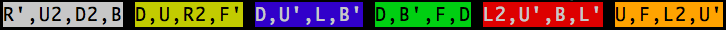

[![Travis build status][travis-badge]][travis-build]
[![Codecov branch][codecov-badge]][codecov]
[![npm][npm-badge]][npm-version]
[![downloads][downloads-badge]][npmcharts]
[![MIT License][license-badge]][license]

[![gzip size][gzip-badge]][unpkg]
[![size][size-badge]][unpkg]

[![Maintainability][code-climate-badge]][code-climate]
[![PRs Welcome][pull-request-badge]](http://makeapullrequest.com)

# rubiks-cube-scramble-cli

A Node CLI that gives you Rubik's cube scrambles.

# Getting started

``` shell
npm install --global rubiks-cube-scramble-cli

getScramble
# Get Rubik's cube scramble

getScramble --number=5
# Get 5 Rubik's cube scrambles

getScramble -n=5
# Get 5 Rubik's cube scrambles
```




[codecov]: https://codecov.io/gh/newyork-anthonyng/rubiks-cube-scramble-cli
[codecov-badge]: https://img.shields.io/codecov/c/github/newyork-anthonyng/rubiks-cube-scramble-cli/master.svg
[code-climate]: https://codeclimate.com/github/newyork-anthonyng/rubiks-cube-scramble-cli/maintainability
[code-climate-badge]: https://api.codeclimate.com/v1/badges/faefec967ef40a030c3e/maintainability
[downloads-badge]: https://img.shields.io/npm/dm/rubiks-cube-scramble-cli.svg?style=flat-square
[license]: https://github.com/newyork-anthonyng/rubiks-cube-scramble-cli/blob/master/LICENSE
[license-badge]: https://img.shields.io/npm/l/rubiks-cube-scramble-cli.svg?style=flat-square
[npmcharts]: https://npmcharts.com/compare/rubiks-cube-scramble-cli
[npm-version]:https://www.npmjs.com/package/rubiks-cube-scramble-cli
[npm-badge]: https://img.shields.io/npm/v/rubiks-cube-scramble-cli.svg?style=flat-square
[pull-request-badge]: https://img.shields.io/badge/PRs-welcome-brightgreen.svg?style=flat-square
[travis-badge]: https://travis-ci.org/newyork-anthonyng/rubiks-cube-scramble-cli.svg?branch=master
[travis-build]: https://travis-ci.org/newyork-anthonyng/rubiks-cube-scramble-cli
[gzip-badge]: http://img.badgesize.io/https://unpkg.com/rubiks-cube-scramble-cli?compression=gzip&label=gzip%20size&style=flat-square
[size-badge]: http://img.badgesize.io/https://unpkg.com/rubiks-cube-scramble-cli?label=size&style=flat-square
[unpkg]: https://unpkg.com/rubiks-cube-scramble-cli